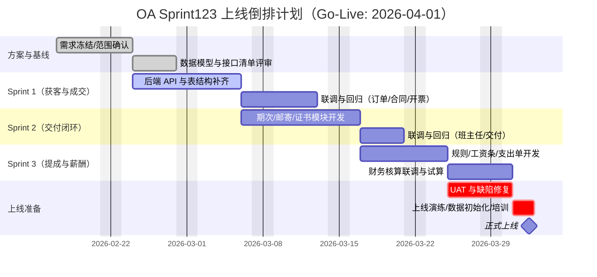

# OA Sprint 1/2/3 设计与落地方案

> 目标：把“获客→成交→交付→复购→核算→工资”做成可闭环、可审计、可导出的业务系统。

## Sprint 1（获客与成交闭环）

### 范围
1. 资料库与引流活动管理（运营）
2. 顾问发放领取链接，客户小程序登录后形成线索
3. 合同与开票资料沉淀，支持订单关联
4. 收款回调日志留存（对接企微/支付宝的技术落点）

### 数据模型
- `oa_material`：资料库
- `oa_material_campaign`：投放活动
- `oa_material_claim`：资料领取记录（含 openid / 手机号）
- `oa_contract`：合同
- `oa_invoice_profile`：开票资料
- `oa_invoice`：发票记录
- `oa_payment_callback_log`：支付回调日志

### 核心流程
- 运营建资料 → 创建活动 → 顾问生成发放链接
- 客户小程序登录领取资料 → 记录领取 + 回传身份
- 顾问成交建订单 → 关联合同、开票资料 → 财务开票

### 验收
- 资料、活动、合同、发票、领取记录可 CRUD/查询
- 支付回调日志可写入并追溯

---

## Sprint 2（交付闭环）

### 范围
1. 班主任排期次、分配学员
2. 实体资料邮寄
3. 线上/线下证书模板与发放
4. 小程序侧进度/证书读取的数据基础

### 数据模型
- `oa_class_term`：课程期次
- `oa_student_term_rel`：学员-期次关系
- `oa_shipment`：邮寄记录
- `oa_certificate_template`：证书模板
- `oa_certificate_issue`：证书发放记录

### 核心流程
- 班主任设置期次并把学员加入期次
- 生成并跟踪邮寄单
- 学员结课后发放证书

### 验收
- 期次、邮寄、证书发放可追踪
- 学员与期次关系可查询

---

## Sprint 3（提成与薪酬闭环）

### 范围
1. 分成规则与适用范围
2. 手工调节提成并保留审计
3. 薪资期间、工资条、工资发放
4. 支出单（成本）记账

### 数据模型
- `oa_commission_rule`：分成规则
- `oa_commission_scope`：规则作用范围（部门/组/员工/课程）
- `oa_commission_calc`：提成计算明细
- `oa_commission_adjustment`：手工调节记录
- `oa_payroll_period`：薪资期间
- `oa_payroll_slip`：工资条
- `oa_payroll_item`：工资条明细项（基本工资/提成/个税/社保等）
- `oa_salary_payment_log`：工资发放记录
- `oa_expense_voucher`：支出单

### 核心流程
- 规则配置 → 自动计算提成 → 审批后可人工调节
- 财务按月生成工资条并发放，留痕核对

### 验收
- 规则、调节、工资条、发放与支出都可追溯
- 具备可导出基础字段

---

## 本次代码落地（本次提交）

1. 增加 Sprint123 扩展建表脚本 `db/sprint123_extension.sql`
2. 增加统一 bootstrap：`api/sprint123_bootstrap.php`
3. 新增 API：
   - `api/materials.php`
   - `api/material_campaigns.php`
   - `api/material_claims.php`
   - `api/contracts.php`
   - `api/invoice_profiles.php`
   - `api/invoices.php`
   - `api/class_terms.php`
   - `api/student_terms.php`
   - `api/shipments.php`
   - `api/commission_rules.php`
   - `api/commission_adjustments.php`
   - `api/payroll_periods.php`
   - `api/payroll_slips.php`
   - `api/expense_vouchers.php`

> 说明：前端页面可在下一次迭代按同样模块继续补齐。当前优先打通数据结构与后端 API。

## 本轮复盘改进（针对上一版）

- 补齐 Sprint 设计与后端落地不一致的问题：将 `oa_payment_callback_log`、证书、分成 scope/calc、工资条明细与工资发放日志纳入运行期 bootstrap。
- 新增缺失 API：支付回调日志、证书模板/发放、分成作用范围/计算明细、工资条明细、工资发放日志。
- 后续建议：按模块增加前端页面与小程序接口，并补充角色级字段权限与审批流。

---

## 上线倒排甘特图（假设 4 月 1 日上线）

> 说明：
> - 若上线年份不是 2026，可整体平移日期，保持“4 月 1 日上线”与任务前后依赖不变。
> - `UAT 与缺陷修复`、`上线演练/数据初始化/培训` 建议设为强约束（critical），避免压缩导致上线风险升高。
